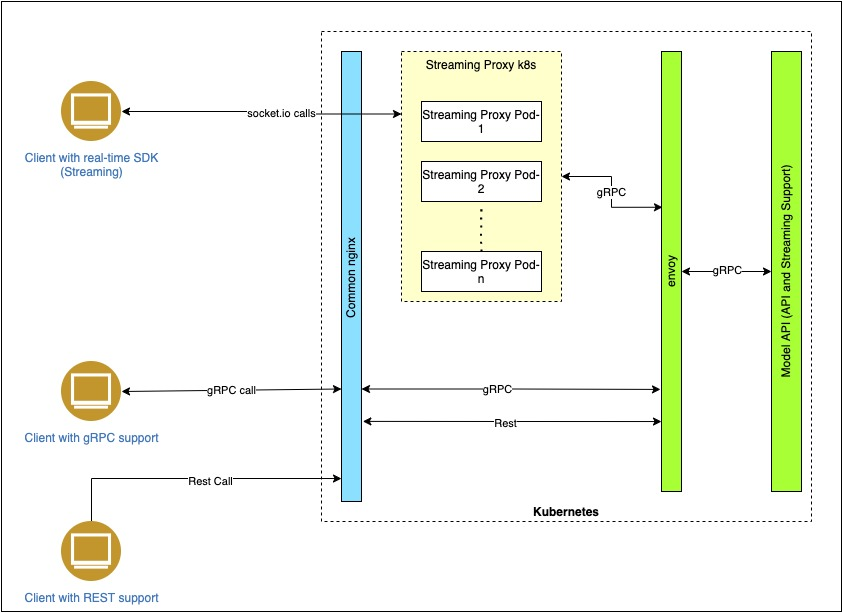
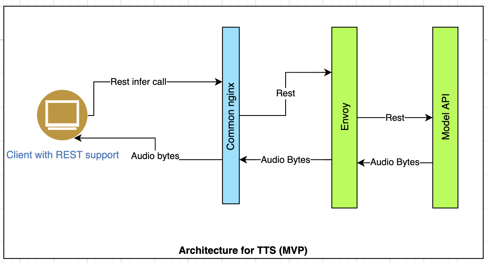
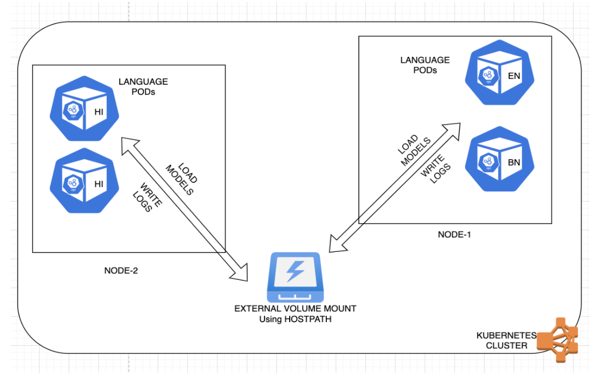

# ASR and TTS API Deployment Guide

We have developed two services for deployment in the CDAC Kubernetes environment. The services are:
1) ASR
2) TTS


<!-- ABOUT THE PROJECT -->
## AUTOMATIC SPEECH RECOGNITION(ASR)

Our speech-to-text interface enables us to accurately convert speech into text using an API powered by deep learning neural network algorithms for automatic speech recognition (ASR) in Indic languages. This service also enables us to infer in a batch mode over REST protocol to transcribe speech audio files. This also has a streaming service that provides an interface to accept chunks of the continuous audio stream that can be transcribed in real-time to text.

### Architecture

The architecture for ASR service with both batch and real-time mode is shown here. 

    
<div align="center">
Fig 1
</div>


### Artifacts

The latest image for the ASR service can be found at `gcr.io/ekstepspeechrecognition/speech_recognition_model_api:<version>`

The code repository for the ASR API service can be found at https://github.com/Open-Speech-EkStep/speech-recognition-open-api

The deployment infra code repository for the ASR API service can be found at 
https://github.com/Open-Speech-EkStep/speech-recognition-open-api-infra

### Infrastructure Requirements

1.A fully operational Kubernetes cluster with at least 3 nodes, each containing at least 8CPUs 64Gb RAM and 1 Tesla T4 GPU of 16GB. This is a basic requirement to support 50-100 concurrent users at ease. For higher user support, better GPU configurations are highly recommended.

2.A mountable disk or network drive of at least 50GB to store the models and artifacts for ASR. This disk/drive should be part of the same zone as the K8 cluster so it can be easily mounted to the Kubernetes pods.

3.The cluster should be publicly accessible using an IP exposed by the load balancer.

4.Jenkins can be set up optionally as a deployment pipeline of CI/CD and configured with the infra code repository.

### Deployment components and steps

The various components or modules as shown in the above Fig 1 are required to be installed in a package for the service to work successfully.

**Loading models files and artifacts**: The first step towards deployment is dumping the model files for every language into their respective language directories and placing them inside the external mountable disk at a designated location. Once the models are placed, create a file named ‘model_dict.json’ in the same hierarchy as the language directories. The model_dict.json should have the respective paths of the language model files and the setting for ITN and punctuation for every language. The ASR models for every languauge can be downloaded from ​​https://storage.googleapis.com/asr-public-models/data-sources-deployment/.
ITN and punctuation models are downloaded automatically from the buckets,so not needed to be placed manually.

Sample model_dict.json
```json
{
    "en": {
        "path": "/indian_english/final_model.pt",
        "enablePunctuation": true,
        "enableITN": true
    },
    "hi": {
        "path": "/hindi/hindi.pt",
        "enablePunctuation": true,
        "enableITN": true
    },
    "ta": {
        "path": "/tamil/final_model.pt",
        "enablePunctuation": true,
        "enableITN": true
    }
}
```
The models from the external volume needs to be mounted at `/opt/text_to_speech_open_api/deployed_models/ ` inside the pod. The volume mounts are specified in https://github.com/Open-Speech-EkStep/speech-recognition-open-api-infra

**Ngnix**: A NGNIX router should be deployed and be publicly exposed as a load balancer service. The ngnix conf file should be updated with proper location blocks to support asr and punctuate endpoints.
Sample ngnix.conf

```json
server {
    server_name  <server-name>;
    listen 443 ssl default http2;
    listen [::]:443 ssl default http2 ipv6only=on;
    ssl_certificate    /etc/ssl/ulcacontrib_ssl.crt;
    ssl_certificate_key    /etc/ssl/ulcacontrib_ssl.key;
    resolver 127.0.0.11;
    underscores_in_headers on;
    client_max_body_size 10M;
    client_header_timeout 600;
    client_body_timeout 600;
    fastcgi_read_timeout 600;
    proxy_connect_timeout       600;
    proxy_send_timeout          600;
    proxy_read_timeout          600;
    send_timeout                600;
    gzip on;
    gzip_proxied any;
    gzip_types text/plain text/xml text/css application/json application/x-javascript text/javascript application/javascript;
    gzip_vary on;
    gzip_disable "MSIE [1-6]\.(?!.*SV1)";
    gzip_comp_level 6;
    gzip_buffers 16 8k;
    gzip_min_length 512;
    add_header Access-Control-Allow-Origin * always;
    add_header Access-Control-Allow-Headers * always;
    location /punctuate {
      proxy_set_header Upgrade $http_upgrade;
      proxy_set_header Connection "upgrade";
      proxy_http_version 1.1;
      proxy_set_header X-Forwarded-For $proxy_add_x_forwarded_for;
      proxy_set_header Host $host;
      proxy_pass https://inference.vakyansh.in/punctuate;
    }
    location /asr {
        resolver 127.0.0.11;
        return 302 /asr/;
    }
    location /asr/ {
        resolver 127.0.0.11;
        proxy_pass  http://asr-model-v2-envoy/;
        proxy_http_version 1.1;
        proxy_set_header Upgrade $http_upgrade;
        proxy_set_header Connection "Upgrade";
        proxy_set_header Host $host;
    }
    location /socket.io/ {
        proxy_set_header Upgrade $http_upgrade;
        proxy_set_header Connection "upgrade";
        proxy_http_version 1.1;
        proxy_set_header X-Forwarded-For $proxy_add_x_forwarded_for;
        proxy_set_header Host $host;
        proxy_pass http://asr-model-v2-proxy-server:9009/socket.io/;
    }
}
server {
  server_name localhost;
  resolver 127.0.0.11;
  listen 50051 http2;
  location / {
    grpc_pass grpc://asr-model-v2-envoy;
  }
}
```
Ngnix is a manual deployment by the infra team and used as a common component for all services.

**Streaming Proxy**: This is an important component for the streaming service to work with Socket.io connections from the browser clients. The proxy is deployed automatically as part of the deployment package with envoy and ASR service. No explicit install are required.

**Envoy**: This is a transcoder that helps to convert REST calls from the batch API to GRPC calls to the API. All GRPC and REST connections have to pass through the envoy before it reaches the ASR API servers.

**Model API server**: The model API server for every language or cluster of languages is deployed as separate pods in the cluster. 
The language clusters and node accelerators can be configured in the file app_config.yaml. The volume paths can also be correctly configured in the deployment.yaml files and values.yaml files. These files post changes can be committed to the repo,
https://github.com/Open-Speech-EkStep/speech-recognition-open-api-infra/tree/cdac-deploy

The deployment for proxy, envoy and API server language pods can be configured using Jenkins or can be triggered manually by running the below command in a bastion/window node of CDAC. All three components can be deployed at once.
`python3 deploy.py --namespace <kubernetes namespace> --api-updated True --image-name gcr.io/ekstepspeechrecognition/speech_recognition_model_api --image-version <latest image version>`

With the successful deployment of components, the pods and services should get spawned for proxy, envoy, and language APIs.

### API for CDAC:

The REST API endpoint can be accessible for POST requests `https://cdac.ulcacontrib.org/asr/v1/recognize/<language_code>`
For streaming from browser, Client SDK can be used for accessing ASR models. `https://github.com/Open-Speech-EkStep/speech-recognition-open-api-client`

## TEXT TO SPEECH SERVICE(TTS):

Text To Speech (TTS), also known as Speech Synthesis, is a process where text is converted into a human-sounding voice. TTS has been a popular choice for developers and business users alike when building IVR (Interactive Voice Response) solutions and other voice applications, as it accelerates time to production without having to record audio files with human voices. Using recorded files requires recording each message with a human voice, whereas TTS prompts can be dynamically generated from raw text.
Our TTS service can enable us to generate life-like speech synthesis in both male and female voices for an array of Indic languages like Hindi, Tamil, Malayalam,Kannada, and many more.

### Architecture:

The architecture for TTS service is shown here. This service only supports batch inference from REST clients via POST requests. The response returned by the API contains an audio bytes payload for successful inference.

 
<p align="justify">
Fig 2
</p>

### Artifacts:

The latest image for the TTS service can be found at `gcr.io/ekstepspeechrecognition/text_to_speech_open_api:<version>`

The code repository for the TTS API service can be found at `https://github.com/Open-Speech-EkStep/text-to-speech-open-api`

The deployment infra code repository for the TTS API service can be found at 
`https://github.com/Open-Speech-EkStep/text-to-speech-open-api-infra`

### Infrastructure Requirements:

A fully operational Kubernetes cluster with at least 3 nodes, each containing at least 8CPUs 64Gb RAM and 1 Tesla T4 GPU of 16GB. This is a basic requirement to support 50-100 concurrent users at ease. For higher user support, better GPU configurations are highly recommended.

A mountable disk or network drive of at least 50GB to store the models and artifacts for TTS. This disk/drive should be part of the same zone as the K8 cluster so it can be easily mounted to the Kubernetes pods.

The cluster should be publicly accessible using an IP exposed by the load balancer.

Jenkins can be set up optionally as a deployment pipeline of CI/CD and configured with the infra code repository.

### Deployment components and steps:

The various components or modules as shown in the above Fig 1 are required to be installed in a package for the service to work successfully.

**Loading models files and artifacts**: The first step towards deployment is dumping the model files for every language into their respective language directories and placing them inside the external mountable disk at a designated location. Here for TTS we have TTS models and transliteration models to be placed in the respective directories.  Refer readme for directory structure `https://github.com/Open-Speech-EkStep/text-to-speech-open-api`.

**TTS MODELS**:Once the tts models are downloaded from `https://storage.googleapis.com/vakyaansh-open-models/tts-models/`, create a file named `model_dict.json` in the same hierarchy as the language directories. The model_dict.json should have the respective paths of the language model files and the setting for ITN and punctuation for every language.

Sample model_dict.json
```json	
{
"hi" : {"male_glow" : "hindi/male/glow_tts",
        "male_hifi" : "hindi/male/hifi_tts",
        "female_glow" : "hindi/female/glow_tts",
        "female_hifi" : "hindi/female/hifi_tts"
}
}
```
**TRANSLITERATION MODELS**:The transliteration models aren’t required to be downloaded and placed manually for the first time. But the file named ‘default_lineup.json’ needs to be placed in the directory named ‘translit_models’ in the external volume.This helps to get the models downloaded for the first time.
The contents of the default_lineup.json should be:
```json	
{

    "bn": {
        "name"    : "Bengali - বাংলা",
        "eng_name": "bengali",
        "script"  : "bengali/bn_scripts.json",
        "vocab"   : "bengali/bn_words_a4b.json",
        "weight"  : "bengali/bn_101_model.pth"
    },

    "gu": {
        "name"    : "Gujarati - ગુજરાતી",
        "eng_name": "gujarati",
        "script"  : "gujarati/gu_scripts.json",
        "vocab"   : "gujarati/gu_words_a4b.json",
        "weight"  : "gujarati/gu_101_model.pth"
    },

    "hi": {
        "name"    : "Hindi - हिंदी",
        "eng_name": "hindi",
        "script"  : "hindi/hi_scripts.json",
        "vocab"   : "hindi/hi_words_a4b.json",
        "weight"  : "hindi/hi_111_model.pth"
    },

    "kn": {
        "name"    : "Kannada - ಕನ್ನಡ",
        "eng_name": "kannada",
        "script"  : "kannada/kn_scripts.json",
        "vocab"   : "kannada/kn_words_a4b.json",
        "weight"  : "kannada/kn_101_model.pth"
    },

    "gom": {
        "name"    : "Konkani (Goan) - कोंकणी",
        "eng_name": "konkani",
        "script"  : "konkani/gom_scripts.json",
        "vocab"   : "konkani/gom_words_subset.json",
        "weight"  : "konkani/gom_122_model.pth"
    },

    "mai": {
        "name"    : "Maithili - मैथिली",
        "eng_name": "maithili",
        "script"  : "maithili/mai_scripts.json",
        "vocab"   : "maithili/mai_words_subset.json",
        "weight"  : "maithili/mai_122_model.pth"
    },


    "ml": {
        "name"    : "Malayalam - മലയാളം",
        "eng_name": "malayalam",
        "script"  : "malayalam/ml_scripts.json",
        "vocab"   : "malayalam/ml_words_a4b.json",
        "weight"  : "malayalam/ml_101_model.pth"
    },

    "mr": {
        "name"    : "Marathi - मराठी",
        "eng_name": "marathi",
        "script"  : "marathi/mr_scripts.json",
        "vocab"   : "marathi/mr_words_a4b.json",
        "weight"  : "marathi/mr_102_model.pth"
    },

    "pa": {
        "name"    : "Panjabi - ਪੰਜਾਬੀ",
        "eng_name": "panjabi",
        "script"  : "panjabi/pa_scripts.json",
        "vocab"   : "panjabi/pa_words_a4b.json",
        "weight"  : "panjabi/pa_101_model.pth"
    },

    "sd": {
        "name"    : "Sindhi - سنڌي‎",
        "eng_name": "sindhi",
        "script"  : "sindhi/sd_scripts.json",
        "vocab"   : "sindhi/sd_words_ccset.json",
        "weight"  : "sindhi/sd_101_model.pth"
    },

    "si": {
        "name"    : "Sinhala - සිංහල",
        "eng_name": "sinhala",
        "script"  : "sinhala/si_scripts.json",
        "vocab"   : "sinhala/si_words_ccset.json",
        "weight"  : "sinhala/si_101_model.pth"
    },

    "ta": {
        "name"    : "Tamil - தமிழ்",
        "eng_name": "tamil",
        "script"  : "tamil/ta_scripts.json",
        "vocab"   : "tamil/ta_words_a4b.json",
        "weight"  : "tamil/ta_101_model.pth"
    },

    "te": {
        "name"    : "Telugu - తెలుగు",
        "eng_name": "telugu",
        "script"  : "telugu/te_scripts.json",
        "vocab"   : "telugu/te_words_a4b.json",
        "weight"  : "telugu/te_101_model.pth"
    },

    "ur": {
        "name"    : "Urdu - اُردُو",
        "eng_name": "urdu",
        "script"  : "urdu/ur_scripts.json",
        "vocab"   : "urdu/ur_words_ccset.json",
        "weight"  : "urdu/ur_101_model.pth"
    }
}
```
The models from the external volume needs to be mounted at `/opt/text_to_speech_open_api/deployed_models/`  inside the pod. The volume mounts are specified in `https://github.com/Open-Speech-EkStep/text-to-speech-open-api-infra` 

**Ngnix**: A NGNIX router should be deployed and be publicly exposed as a load balancer service.It acts as a reverse-proxy for all traffic coming in. The ngnix conf file should be updated with proper location blocks to support TTS endpoints similar to the ASR implementation.
Ngnix is a manual deployment by the infra team and used as a common component for all services. 

**Envoy**: Here for TTS, the envoy acts as a load balancer service for redirecting traffic to the API pods at the backend.The envoy is responsible for handling all REST based requests to the API.

**Model API server**: The model API server for every language or cluster of languages is deployed as separate pods in the cluster. 
The language clusters and node accelerators can be configured in the file app_config.yaml. The volume paths can also be correctly configured in the deployment.yaml files and values.yaml files. These files post changes can be committed to the repo,
`https://github.com/Open-Speech-EkStep/text-to-speech-open-api-infra/tree/cdac-deploy`

The deployment for envoy and API server language pods can be configured using Jenkins or can be triggered manually by running the below command in a bastion/window node of CDAC. All three components can be deployed at once.
`python3 deploy.py --namespace <kubernetes namespace> --api-updated True --image-name gcr.io/ekstepspeechrecognition/text-to-speech-open-api
--image-version <latest image version>`

With the successful deployment of components, the pods and services should get spawned for envoy, and language APIs.

### API for CDAC:
The REST API endpoint can be accessible for POST requests `https://cdac.ulcacontrib.org/tts/v1/<language_code>`

The below figure shows how our pods are able to load the model files from the volume mounts and write back application logs to the volume.

 Fig 3


## Contributing

Contributions are what make the open source community such an amazing place to be learn, inspire, and create. Any contributions you make are **greatly appreciated**.

1. Fork the Project
2. Create your Feature Branch (`git checkout -b feature/AmazingFeature`)
3. Commit your Changes (`git commit -m 'Add some AmazingFeature'`)
4. Push to the Branch (`git push origin feature/AmazingFeature`)
5. Open a Pull Request

## License

Distributed under the [MIT] License. See `LICENSE` for more information.

## Git repository

[https://github.com/Open-Speech-EkStep/text-to-speech-open-api-infra.git](https://github.com/Open-Speech-EkStep/text-to-speech-open-api-infra.git)

## Contact

Connect with community on [Gitter](https://gitter.im/Vakyansh/community?utm_source=share-link&utm_medium=link&utm_campaign=share-link)

Project Link: [https://github.com/Open-Speech-EkStep/text-to-speech-open-api-infra.git](https://github.com/Open-Speech-EkStep/text-to-speech-open-api-infra.git)


