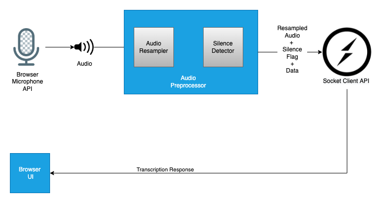

# Speech Recognition Streaming Service

Our speech to text interface enables you to accurately convert speech into text using an API powered by deep learning neural network algorithms for automatic speech recognition (ASR). To know more, [Click Here](/asr_model_api/)

This Streaming API provides an interface to accept chunks of continuous audio stream that can be transcribed in realtime to text by using the above mentioned speech to text interface.

This service is enabled to provide the following features:

* Speech to text transcription support for a growing list of indic languages.

* Transcribe your content in real time from stored files or audio bytes.

The Developer documentation provides you with a complete set of guidelines which you need to get started with.

## Table of Contents

* [Architecture overview](#architecture-overview)
* [Components](#components)
  * [Grpc Server](#GRPC-Server)
  * [Grpc Client](#GRPC-Client)
  * [Proxy Service](#Proxy-Service)
    * [Reason for using proxy component](#Reason-for-using-proxy-component)
    * [Socket.io server](#Socket.io-server)
    * [Nodejs Grpc client](#Nodejs-Grpc-client)
  * [Browser Client SDK](#Browser-Client-SDK)
* [Quick Start](#quick-start)
* [Tips](#tips)
* [Contribute to the project](#contribute-to-the-project)
* [License](#license)
* [Git Repositories](#git-repositories)
* [Contact](#contact)

## Architecture Overview


## Components

This service consists of two main components.

* GRPC client
* GRPC server

It also contains two plugin/support components.

* Proxy service.
* Browser client sdk.

### GRPC Server

In this streaming service, the grpc server provides a method that supports bi-directional streaming to allow users to stream audio bytes continuously and get stream of text as output. The audio bytes provided in the stream are pre-processed and provided to the model (Speech to text model) for inferencing. As a result, we get a continuous stream of text as output for the given audio stream. This server is capable of handling multiple grpc clients and provide continuous streams of output.

This grpc server is written in `python` programming language.

For more info on grpc servers bi-directional streaming, refer [here](https://grpc.io/docs/what-is-grpc/core-concepts/#:~:text=the%20client%E2%80%99s%20messages.-,Bidirectional%20streaming%20RPC,-In%20a%20bidirectional).

This grpc server is available in the following [Github Link](https://github.com/Open-Speech-EkStep/speech-recognition-open-api)

### GRPC Client

The grpc client allows users/other platforms to connect to the grpc server through a channel and call the required RPC methods.Grpc clients are available in multiple programming languages like python, nodejs, java, etc.

In this streaming service, we are using `nodejs` grpc client to connect with the streaming service.

To allow users to connect to our grpc server from browsers, we have created a `proxy service` which uses `socket.io` to maintain two way connections so that audio can be streamed from the user using browsers and send it to the grpc server from the proxy using `nodejs` grpc client.

### Proxy Service

This service allows browser-users/web-applications to stream audios to the grpc server and provides the streaming transcriptions back to the browser-users/web-applications.

It is available in the following [Github Link](https://github.com/Open-Speech-EkStep/speech-recognition-open-api-proxy).

#### Reason for using proxy component

To use grpc client in browsers, we need to use a library called grpc-web. To know more about why grpc-web is needed, refer [here](https://grpc.io/blog/state-of-grpc-web/).

But, in the grpc-web library, there was no support for bi-directional streaming currently when this project was developed. So we have adopted to create our proxy service to create a realtime processing environment.

The proxy service is developed using `nodejs`.

The components of the proxy service are:

* Socket.io server
* Nodejs Grpc client

#### Socket.io server

This socket.io server create events and listens to the incoming audio streams and provides the received audio streams to the grpc client. Once the socket.io server receives the stream of transcriptions from the nodejs grpc client, it will emit `result` events to the socket.io client connected to this server.

#### Nodejs Grpc client

This nodejs grpc client creates a channel with the grpc server for each incoming user and streams the audio through the RPC method. Once the RPC method returns the stream of transcriptions, it will provide it to the socket.io server.

### Browser Client SDK

To connect to the proxy and stream audio, we can use a socket.io client. Since we need to do a lot of pre-processing and maintain the socket events needed, we have created a client sdk available as a npm library.

This client sdk can be imported in any node related frameworks such as React, angular, etc.
It will provide methods to connect and stream audio to the proxy service.



To know more, refer to this [Github link](https://github.com/Open-Speech-EkStep/speech-recognition-open-api-client).

To get started with this Browser client sdk, refer to the Readme in the above github link.

## Quick Start

1. Download and install docker.
2. Pre-built docker images are hosted on gcr.io/ekstepspeechrecognition/speech_recognition_model_api. We do not follow the latest tag, so you have to use a specific tag. You can pull the image using the command given below:

    ```docker
    docker pull gcr.io/ekstepspeechrecognition/speech_recognition_model_api:3.2.25
    ```

3. Create a directory deployed_models using the command: `mkdir deployed_models`
4. Inside deployed_models folder, create a folder for each language. eg: `mkdir hindi`
5. Download asr fine-tuned models and language models for the languages you need from the link given [here](https://github.com/Open-Speech-EkStep/vakyansh-models#finetuned-asr-models-works-on-v2-hydra-branch).
6. Directory structure of `deployed_models/`:

    ```shell
    .
    |-- hindi
    |   |-- hindi_infer.pt
    |   |-- dict.ltr.txt
    |   |-- lexicon.lst
    |   |-- lm.binary
    |-- english
    |   |-- english_infer.pt
    |   |-- dict.ltr.txt
    |   |-- lexicon.lst
    |   |-- lm.binary
    |-- model_dict.json
    ```

7. Run the streaming grpc server using the following command:

    ```docker
    docker run -itd -p 50051:50051  --env gpu=True --env languages=['en'] --gpus all -v /home/user/project/deployed_models/:/opt/speech_recognition_open_api/deployed_models/ gcr.io/ekstepspeechrecognition/speech_recognition_model_api:3.2.25
    ```

8. This will keep the streaming grpc server up and running in port `50051` as mentioned in the above docker command.
9. Download nodejs.
10. Clone the proxy service from github:

    ```git
    git clone https://github.com/Open-Speech-EkStep/speech-recognition-open-api-proxy.git
    ```

11. Run `cd speech-recognition-open-api-proxy`.
12. Install the project dependencies: `npm i`.
13. Configure the `language_map.json` file so that it points to the grpc server which is hosted in port `50051` in the above steps.
For example:

    ```json
    {
        "<ip-address/host>:<port>": [
            "hi",
            "en"
        ],
        "localhost:50051": [
            "ta",
            "te"
        ],
    }
    ```

14. Set the folder path of language_map.json as env variable `config_base_path="<project-root-folder>"`(eg: /users/node/speech-recognition-open-api-proxy).
15. Run the proxy service: `npm start`.
16. The proxy service will be up and running in port `9009`.
17. To create a streaming web ui, clone the below repository from github:

    ```git
    git clone https://github.com/Open-Speech-EkStep/speech-recognition-open-api-client.git
    ```

18. Run `cd speech-recognition-open-api-client && cd examples/react-example`.
19. Install the project dependencies: `npm i`.
20. Open the file : `src/App.js`.
21. In this file, in handleStart() method in line 25 and 26, modify the url and language as you need: example

    ```javascript
      const url = 'http://localhost:9009'; // url of the proxy service
      const language = 'hi'; // this can be en, gu depends on what models you have hosted.
    ```

22. Save and Close the file once the changes are done.
23. Run the service using `npm start`.
24. This will open a browser where you can click on the start button and start speaking. For every pause you provide, you will be getting a streamed transcription output.

## Tips

1. In step 7, multiple languages can be given in one docker container by doing the following for languages env variable.

    ```sh
    --env languages=['en', 'hi']
    ```

2. Multiple docker containers can be created with different language sets and they can all be accessed by using the proxy service. For example, docker container1 is hosted with en,hi on port 50051 and docker container2 is hosted with ta,te on port 50052, then `language_config.json` file content will be as follows:

    ```sh
    {
        "localhost:50051": [
            "hi",
            "en"
        ],
        "localhost:50052": [
            "ta",
            "te"
        ],
    }
    ```

3. Port of the proxy service can be changed `PORT` env variable.

## Contribute to the project

Contributions are what make the open source community such an amazing place to be learn, inspire, and create. Any contributions you make are **greatly appreciated**.

1. Fork the Project.
2. Create your Feature Branch (`git checkout -b feature/AmazingFeature`).
3. Commit your Changes (`git commit -m 'Add some AmazingFeature'`).
4. Push to the Branch (`git push origin feature/AmazingFeature`).
5. Open a Pull Request.

## License

Distributed under the [MIT] License. See `LICENSE` for more information.

## Git repositories

1. Streaming Server : [https://github.com/Open-Speech-EkStep/speech-recognition-open-api.git](https://github.com/Open-Speech-EkStep/speech-recognition-open-api.git).
2. Proxy Service: [https://github.com/Open-Speech-EkStep/speech-recognition-open-api-proxy.git](https://github.com/Open-Speech-EkStep/speech-recognition-open-api-proxy.git).
3. Client SDK: [https://github.com/Open-Speech-EkStep/speech-recognition-open-api-client.git](https://github.com/Open-Speech-EkStep/speech-recognition-open-api-client.git).

## Contact

Connect with community on [Gitter](https://gitter.im/Vakyansh/community?utm_source=share-link&utm_medium=link&utm_campaign=share-link).
