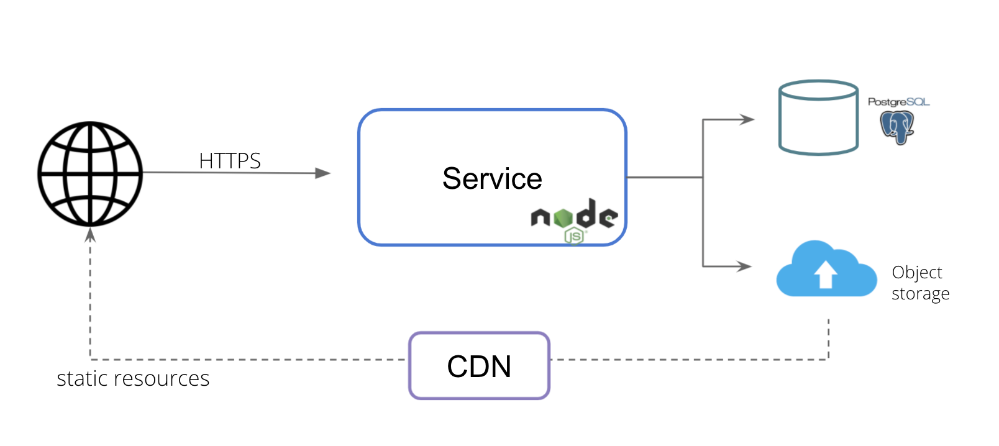
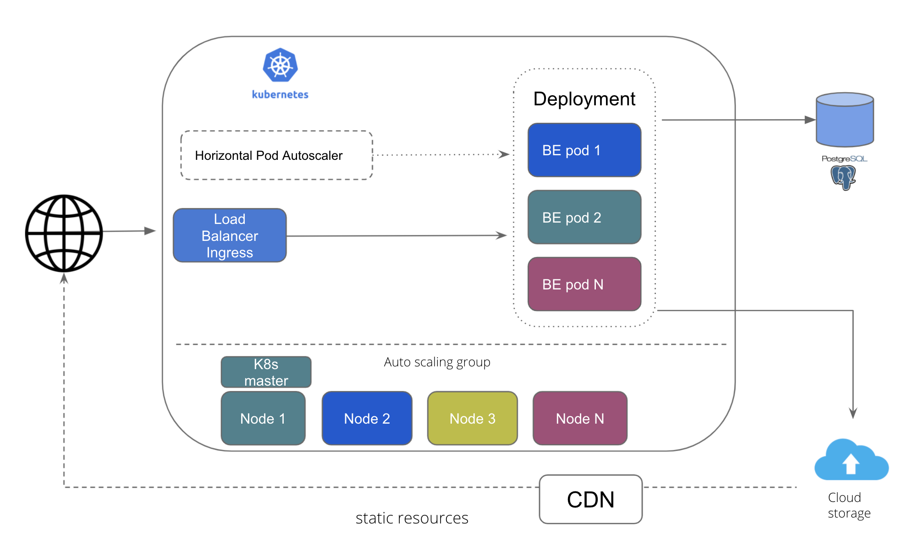
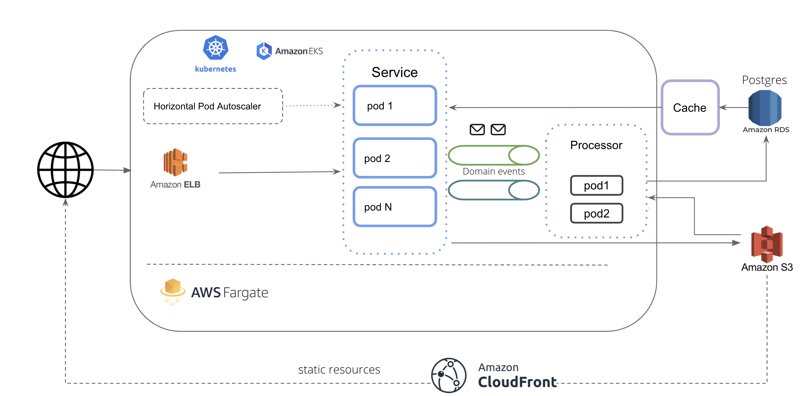
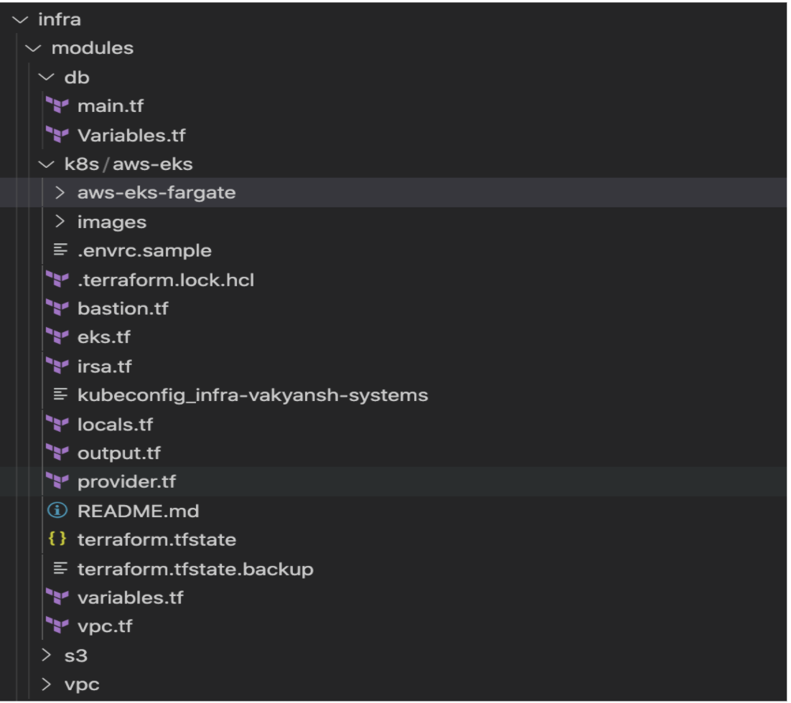
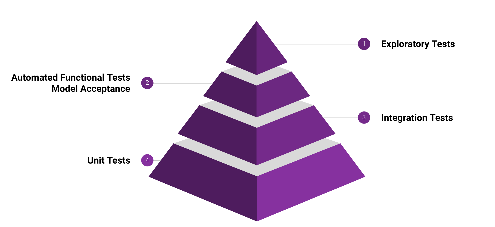
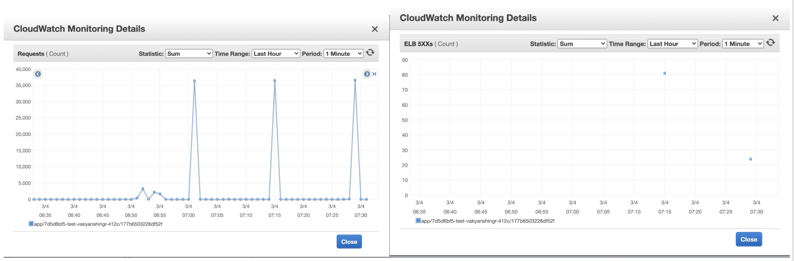

# Crowdsourcing Platform


## About The Project

This web app is a crowdsourcing platform that aims to create open datasets to develop Speech Recognition, Text-to-Speech, Machine Translation and Optical Character Recognition for Indian languages. This will empower our technologists, language enthusiasts and language communities to build world class digital applications in our own local languages. It can be used to crowdsource audio and validate them for various languages.

It comprises four initiatives:
Speech Contribution: It creates a repository of diverse voices speaking Indian languages, where volunteers record their voice by reading a text. They can also choose to validate the audio and corresponding text of other volunteers.
Speech Validation: It creates an open dataset through transcription of audio files. Volunteers can validate the transcriptions for audio files in different languages.
Translation Validation: It creates open parallel translation datasets between corresponding sentences in two languages. Volunteers validate these translations.
Image Validation: It creates an open data repository of images and the corresponding text. Similar to other initiatives, volunteers can validate the labels against the image.

The application makes use of NodeJs, Postgres for Database. It can be hosted on any cloud platform. The current application has code to support AWS and GCP as providers to store the recorded information.
Crowdsourcing Platform’s developer documentation is meant for its adopters, developers and contributors.

The developer documentation helps you to get familiar with the bare necessities, giving you a quick and clean approach to get you up and running. If you are looking for ways to customize the workflow, or just breaking things down to build them back up, head to the reference section to dig into the mechanics of Crowdsourcing Platform.

Data Collection Pipeline is based on an open platform, you are free to use any programming language to extend or customize it but we prefer to use python to perform smart scraping.

The Developer documentation provides you with a complete set of guidelines which you need to:

- Install dependencies for the Crowdsourcing Platform
- Configure Crowdsourcing Platform
- Customize Crowdsourcing Platform
- Extend Crowdsourcing Platform
- Contribute to Crowdsourcing Platform

### Built With

We have used Node.js to build this platform.

- [Node](https://nodejs.org/)

## Architecture

### Logical Architecture

The logical architecture is 3 layered with UI layer implemented using EJS templates, Service layer is implemented in Javascript which run on Nodejs server and storage layer which has RDBS and Object Storage



### Cloud Agnostic Architecture: Kubernetes

This the architecture for deployment on Kubernetes, wherein the service layer is scalable leveraging K8s capabilities.


### Deployment Architecture: AWS

This is the deployement architecure for running portal on AWS infra. It leverages AWS manages services like EKS and Fargate for K8s cluster and AWS RDS for managed database. It also uses AWS managed Load Balancer


### Architecture Improvements

We believe in continously improving the architecture.
Here are some ADR opened : [Architecture Decision Records](https://open-speech-ekstep.github.io/adr)

Proposed Architecture: 

## Languages and Tools


## Dashboard Design


- The transactional tables and view tables are kept separate.
- [Materialized views](https://www.postgresql.org/docs/9.3/rules-materializedviews.html) are used which holds the data as well. This avoids on the fly computations for aggregation for each query.
- The materizaled view are refreshed every 4 hours
- As a part of the refresh job, the aggregated data is dumped as json that is be served directly via CDN.

Advantages:

- Faster reads: Separate view with only 365 aggregated data points per year.
- Less overhead on DB as data queried is on a very small data set and served from S3 buckets
- Transactional tables are optimized for faster writes as we have separate views for reads
- Simplified read queries as complexity is abstracted in views
- AWS RDS managed DB. Can be scaled horizontally and vertically easily if required in future.

## UI Details

Tech Stack : React, NextJs, HTML, CSS

Libraries :

| Libraries       | Name                        | Type                       | License          |
| --------------- | --------------------------- | -------------------------- | ---------------- |
| Chart           | Amcharts 4                  | Free version               | linkware license |
| Keyboard        | react-simple-keyboard       | Open Source                | MIT              |
| Fonts           | Lato, Helvetica, sans serif | Google fonts (Open Source) | OFL              |
| Bootstrap       | Bootstrap                   | Open Source                | MIT              |
| React Class     | Classnames                  | Open Source                | MIT              |
| Blob            | get-blob-duratio            | Open Source                | MIT              |
| PDF             | jspdf                       | Open Source                | MIT              |
| Date & Time     | moment                      | Open Source                | MIT              |
| platform        | platform                    | Open Source                | MIT              |
| Localisation    | next-i18next                | Open Source                | MIT              |
| Image           | sharp                       | Open Source                | MIT              |
| react-slick     | react-slick                 | Open Source                | MIT              |
| swr             | swr                         | Open Source                | MIT              |
| js-levenshtein  | js-levenshtein              | Open Source                | MIT              |
| word-error-rate | word-error-rate             | Open Source                | MIT              |

### Frontend for Crowdsourcing Platform.

## Features

- Supports [these](https://nextjs.org/docs/basic-features/supported-browsers-features) browsers and features.

## Development

- Make sure your following requirements for npm and node are met:

| Package | Version |
| ------- | ------- |
| npm     | 6.14.14 |
| node    | 14.17.5 |

If you are using [nvm](https://github.com/nvm-sh/nvm), you can run `nvm use` in the root directory to install the correct version of node.

- Open your favorite Terminal and run these commands:

```bash
npm install

npm run dev

# Local dev server will automatically starts on http://localhost:8080
```

## Available Scripts

In the project directory, you can run:

### `npm run clean`

Clean up cached or build folders.

### `npm run dev`

Runs the app in the development mode.<br>
Open [http://localhost:8080](http://localhost:8080) to view it in the browser.

The page will reload if you make edits.

### `npm run dev:axe`

Similar to `npm run dev` but also runs [@axe-core/react](https://github.com/dequelabs/axe-core-npm).

### `npm run lint`

For running eslint on source code.

### `npm run lint:fix`

For fixing eslint errors.

### `npm run stylelint`

For running stylelint on source code.

### `npm run stylelint:fix`

For fixing stylelint errors.

### `npm run format`

For running prettier on the source code.

### `npm run typecheck`

For running typescript typecheck.

### `npm run test`

Launches the test runner in the interactive watch mode.

### `npm run test:coverage`

Launches the test runner with coverage.

### `npm run test:lh-ci`

For running [lighthouse-ci](https://github.com/GoogleChrome/lighthouse-ci). Please ensure you ran `npm run build` first before running this command.

### `npm run node-talisman`

For running talisman on the source code.

### `npm run check`

For running lint, stylelint, typecheck, test with coverage and talisman.

### `npm run build`

Builds the app for production to the `.next` folder.

### `npm run build:docker`

Same as `npm run build` but for docker.

### `npm start`

It will start the production server on [http://localhost:8080](http://localhost:8080). Please ensure you ran `npm run build` first before running this command.

### `npm run start:docker`

It will start the production server on [http://localhost:3000](http://localhost:3000) for docker. Please ensure you ran `npm run build:docker` first before running this command.

## Auto Validation

Auto Validation feature validates and warns the users in case their inputs are detected to be different from what actual data should be. It is done by comparing the user input to a machine generated output and validated against a set threshold limit for every initiative. When Auto Validation is enabled for the application, user inputs during the validation are screened depending upon the threshold set for each language in their respective initiatives.

For each initiatives, scores are calculated with user input and the machine generated output. If the scores do not pass the required threshold, the system displays a message on the application screen asking the user to double check their input. In case the users go ahead and submit their input despite the message, the response input is flagged and not validated further.

- Types of scores calculated for initiatives:
  - ASR - WER (Word Error Rate)
  - OCR - Levenstein method
  - Parallel - BleuScore method

The Text Initiative currently does not support auto validation feature.

## CI/CD

- [CircleCI](https://app.circleci.com/pipelines/github/Open-Speech-EkStep/crowdsource-dataplatform) is used for CI/CD.
- Unit tests are run continously for each commit
- Functional Tests are run continously for each commit and act as one if the quality gates before Production deployment
- Automated deployment to K8s for multiple environments
- Database schema changes are done continously and automatically
- Trunk based developement is followed


## Infrastructure as Code

- Infrastructure defined in code with Terraform and shell scripts
- Easily migrate to another AWS account
- Spin up new env easily
  

<!-- GETTING STARTED -->

## Getting Started

To get started install the prerequisites and clone the repo to machine on which you wish to run the application.

### Prerequisites

1. Install `node` library using commands mentioned below.

   - For any linux based operating system (preferred Ubuntu):

     ```
     sudo apt-get install nodejs
     ```

   - For Mac-os:

     ```
     brew install node
     ```

   - Windows user can follow installation steps on [https://nodejs.org/en/#home-downloadhead](https://nodejs.org/en/#home-downloadhead)

2. Install or connect to a postgres database

3. Get credentials from google developer console for google cloud storage access/ or aws cli for amazon s3 storage access.

### Installation

1. Clone the repo using

   ```
   git clone https://github.com/Open-Speech-EkStep/crowdsource-dataplatform.git
   ```

2. Go inside the directory

   ```
   cd crowdsource-dataplatform
   ```

3. Install node requirements

   ```
   npm install
   ```

<!-- USAGE EXAMPLES -->

## Usage

### Common configuration steps:

#### Setting credentials for Google cloud bucket

You can set credentials for Google cloud bucket by running the following command

```
gcloud auth application-default login
```

#### Setting credentials for AWS cloud bucket

You can set credentials for AWS cloud bucket by running the following command

```
aws configure
```

#### Bucket configuration

You can create a specific bucket to store the recorded samples on aws or gcp. And mention those in the environment variables.

#### Environment file configurations

The following are the variables required to run the application, for running on local these can be added to a .env file

```
DB_HOST: The host url where your postgres instance is running
DB_USER: The username to access the db
DB_NAME: The database name
DEV_DB_NAME: The database name specific to dev environment
DB_PASS: The database password
BUCKET_NAME: The bucket name configured on aws or gcp
ENCRYPTION_KEY: Key to run unit tests
PORT: Port to run the application on
```

<!-- RUNNING THE SERVICES -->

## Running services

Make sure the google credentials are present in project root folder in credentials.json file.

You can run the project using the command

```
npm run
```

To run application using a Google cloud bucket

```
npm run gcp
```

To run application using a AWS cloud bucket

```
npm run aws
```

## Database migrations

[This](https://www.npmjs.com/package/db-migrate) package is used to do migrations.

To create the current database structure in your postgres instance, run the following command:

```
db-migrate up
```

It would read the configurations from the path

```
migations/config/migration_config.json
```

Once can also run the migrate up command by setting an environment variable

```
DATABASE_URL=postgresql://${DB_USER}:${DB_PASS}@${DB_HOST}/${DB_NAME}
```

To add a new migration

```
db-migrate create add-new-table
```

Using the above command with the `--sqlFile` flag would create corresponding .sql files in which one can write sql commands to do the operation.

To rollback the last migration, one can

```
db-migrate down
```

Documentation for the package can be found [here](https://db-migrate.readthedocs.io/en/latest/)

## Testing

Multiple types of tests are continously performed to make sure the application is in healthy state.
Pyramid approach is followed with Unit tests at the base and Exploratory tests on top.



### Unit Tests

Unit tests can be run using below command

```sh
npm test
```

### Functional Test

Functional tests can be run using below command

```sh
npm run functional_test -- --env (test|dev)
```

### Scalabiity Test

Scalabiity tests performed to verify that the system is elastically scalable
Below tests were performed

```txt
Test Objective: Scalability Test - Validate elastic scalability
Resource Configuration:
  Environment: Dev
  Pod resources: 0.25 CPU/ 250M RAM
  Horizontal Pod Autoscaler :
    Scaling Threshold - 10% CPU Utilization
    Min pods: 1
    Max Pods: 10

Test configuration:
  Number of concurrent users: 1000
  Total Requests : 15000

Expected: Pods should scale if load increases and CPU utilization goes beyond 10% and should scale down after 5 mins
Actual : Pods were scaled up after the CPU utilization went past 10%. Time to scale to desired state was around 2-3 mins
```

Outcome:  `PASSED`

As surge started, pods started spinning up


### Load Test

Load testing is performed to verify the system is able to handle 5K concurrent users without much impact on latency

```txt
Test Objective: Load Test - Validate if application can handle 5K concurrent users
Date: 04/03/2021

Resource Configuration:
  Environment: Test
  Initial Pods: 3
  Pod resources: 2 CPU/ 2GB RAM
  Horizontal Pod Autoscaler :
    Scaling Threshold - 40% CPU Utilization
    Min pods: 3 , Max Pods: 10
  Database CPU : 4

Test configuration:
Number of concurrent users: 20000
Requests per user : 3
Ramp up time: 10 sec
Iterations: 3
```

Outcome:  `PASSED`

ELB stats:


Database stats:


Jmeter stats:


Summary:

```txt
- This test had 20000 users ramped up within 1 min (3 times).
- The test was performed from a single machine so 20K concurrent users could scale in 1 min.
- All the requests were served within initial resources, no scaling was triggered.
- All three endpoints served response in around 2 sec on an average.
- The system was able to handle upto 12K concurrent users.
- There were some errors thrown by AWS Load balancer may be due to single IP requests.
- Database could handle the load and no connection leak is observed
```

## Security

Security first approach is taken while building this application.
The OWASP top 10 are ingrained in the application security DNA.
Please reach out to srajat@thoughtworks or heerabal@thoughtworks.com for more information around Security

## Running cost estimates

```txt
Cloud : AWS
Amazon RDS (4 CPU): $400
WAF: $30
EKS + Fargate: $75 + $225 = $300
ELB: $150
Others: $200

Total: ~ $1100-1200 per month
```

## Architecture Decision Records

Decision records are maintained [HERE](https://open-speech-ekstep.github.io/adr)

- [Cache above RDBMS](https://open-speech-ekstep.github.io/adr/#caching-layer-above-rdbms)

<!-- CONTRIBUTING -->

## Contributing

Contributions are what make the open source community such an amazing place to be learn, inspire, and create. Any contributions you make are **greatly appreciated**.

1. Fork the Project
2. Create your Feature Branch (`git checkout -b feature/AmazingFeature`)
3. Commit your Changes (`git commit -m 'Add some AmazingFeature'`)
4. Push to the Branch (`git push origin feature/AmazingFeature`)
5. Open a Pull Request

## Walkthrough Videos

1. [Functional / Architecture / Infrastructure Overview](https://drive.google.com/drive/folders/1LzVJ2dVQ_pbB9clOI6-1-VP3Dquprv1G?usp=sharing)
2. [Code Walkthrough - UI](https://drive.google.com/drive/folders/15YSGczIxHS-mikY9m4EqF0OeCPeD7Vkg?usp=sharing)
3. [Code Walkthrough - Backend](https://drive.google.com/drive/folders/1uIT6JxI8EdCoL4So75_V3_JcMxYPtOwO?usp=sharing)
4. [Code Setup](https://drive.google.com/drive/folders/11YFOrs06H_ZmqVCeuqNGQPzUhG3nZ2si?usp=sharing)

## License

Distributed under the [MIT] License. See `LICENSE` for more information.

## Git repository

[https://github.com/Open-Speech-EkStep/crowdsource-dataplatform/](https://github.com/Open-Speech-EkStep/crowdsource-dataplatform/)

## Contact

Connect with community on [Gitter](https://gitter.im/Vakyansh/community?utm_source=share-link&utm_medium=link&utm_campaign=share-link)

Project Link: [https://github.com/Open-Speech-EkStep/crowdsource-dataplatform/](https://github.com/Open-Speech-EkStep/crowdsource-dataplatform/)
