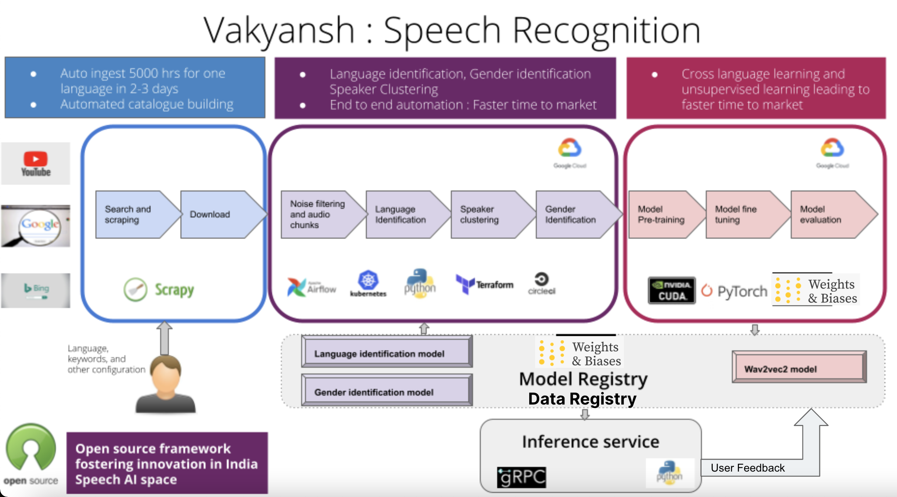

# Welcome to Vakyansh

**Recipies to build Speech Recognition models**

## Introduction

Vakyansh aims to host the key essentials of Automatic Speech Recognition (ASR) technology, focusing on Indian languages. It is a resource that allows people to build applications that leverage speech recognition.

The site will host open data for training ASR models, open source utilities and pipelines to train ASR models and open ASR models themselves. Vakyansh also hosts tools to contribute your voices to create a diverse open data repository of Indian voices to this end. This data will be available in an open manner for all to use. It is a resource that allows people to build applications that leverage speech recognition.

## Open Source

Open sourcing the speech recognition technology empowers us to bring our languages to the core of our fundamentals.
Vakyansh aims to open source the speech recognition models in various languages, the datasets collected through various channels and the linguistic utilities developed to process and clean the data and make it usable by speech recognition tools.

The open source strategy will enable the various language communities, individuals and technologists, who are passionate about their language, to develop speech recognition applications, and integrate them in various domains for the good of the community.

## Getting started

Vakyansh's developer documentation is meant for its adopters, developers and contributors.
It would enable people to innovate and improve and build Speech Recognition Models in any language.

## Modeling Process

## Vakyansh Components

### 1. [Data Collection Pipeline](https://open-speech-ekstep.github.io/data_collection/)

Pipelines to collect data in automated way for the language you want

### 2. [Crowdsourcing Platform](https://open-speech-ekstep.github.io/crowdsource_platform/)

Platform to record and validate voice data from various speakers.

### 3. [Intelligent Data Pipeline](https://open-speech-ekstep.github.io/intelligent_data_pipelines/)

Pipelines to transform raw data and prepare data for model training. They clean, process and balance data for model training

### 4. [Model Training Pipeline](https://open-speech-ekstep.github.io/model_training/)

Pipeline to build state of the art Speech Recognition Model using the data provided by Intelligent Data Pipeline

### 5. CD4ML

MLOPS and CD4ML has been implemented as part of the platform from data preprocessing, model training,data and model versioning upto model hosting. User feedback from the inference service is also incorporated for model improvisations. 

## Vakyansh Technical Overview

The Developer documentation provides you with a complete set of guidelines which you need to:

- Install Vakyansh
- Configure Vakyansh
- Customize Vakyansh
- Extend Vakyansh
- Contribute to Vakyansh

## Discussion
Connect with community on [Gitter](https://gitter.im/Vakyansh/community?utm_source=share-link&utm_medium=link&utm_campaign=share-link)

