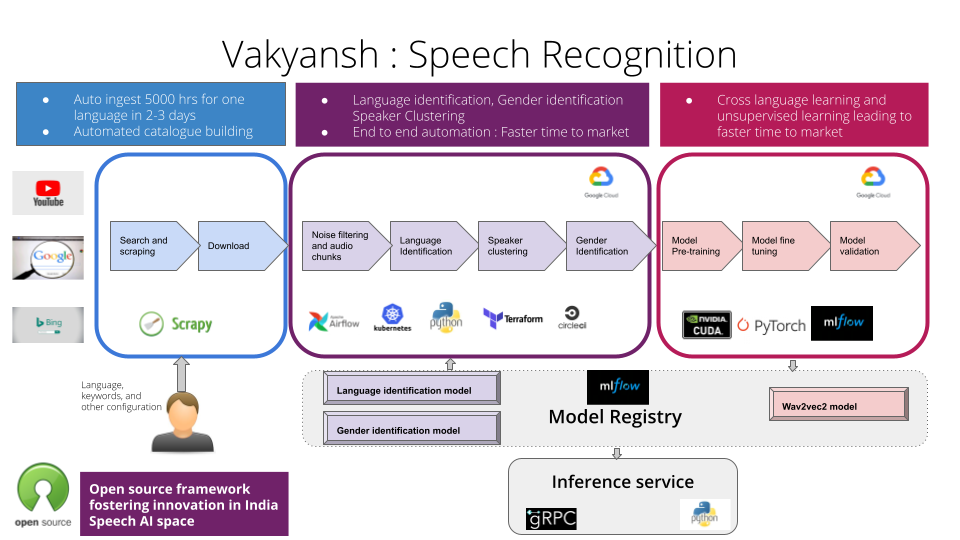

# Welcome to Vakyansh

## **Recipies to build Speech Recognition models**

## Introduction

Vakyansh is an open-source set of recipes to build Speech Recognition models from scratch right from data collection,
data cleaninig, data processing, data analysis and model training. The intelligent pipelines are available part of the recipes which allows to prepare audio data without manual analysis of audio. 

## Getting started

Vakyansh's developer documentation is meant for its adopters, developers and contributors.
It would enable people to innovate and improve and build Speech Recognition Models in any language.
The recipes can be picked and chosen based on the requirement or they can be used as whole package if starting from scratch.

## Modeling process

## Vakyansh components

1. [Data Collection Pipeline](https://open-speech-ekstep.github.io/mkdocs/smart_crawlers/)
2. [Intelligent Data Pipeline](https://open-speech-ekstep.github.io/mkdocs/data_pipelines/)
3. Model Training Pipeline

## Tech in one view

The Developer documentation provides you with a complete set of guidelines which you need to:

- Install Vakyansh
- Configure Vakyansh
- Customize Vakyansh
- Extend Vakyansh
- Contribute to Vakyansh
