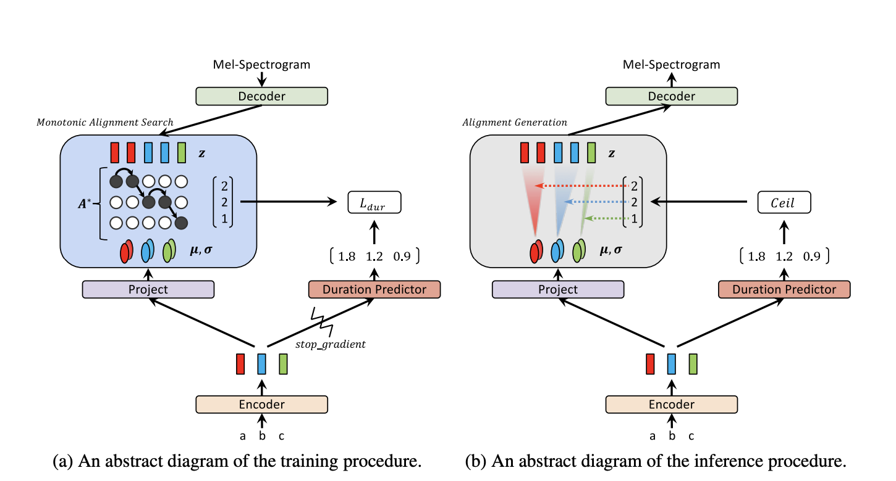
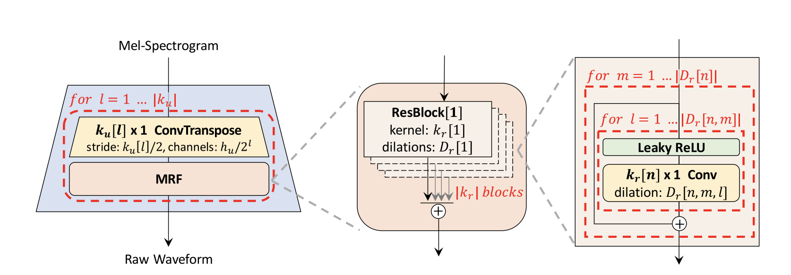

# vakyansh-tts

## Models
Our open-sourced TTS models for Indic languages are present in this [repo](https://github.com/Open-Speech-EkStep/vakyansh-models).

## Components
There are two models at work that convert your text to an audio. First of all, we train a glow-TTS text-to-mel model to convert text to mel spectrogram. This mel spectrogram is then passed as input to a mel-to-wav model (HiFi-GAN) which converts it to an audio.


1. Text to Mel: We use _Glow-TTS: A Generative Flow for Text-to-Speech via Monotonic Alignment Search_ proposed [here](https://arxiv.org/abs/2005.11129). You can find the original source code implemented by the authors [here](https://github.com/jaywalnut310/glow-tts).

    
    
    <p align="center">

    </p>
    <p align="center">
    </p>


2. Mel to Wav: We use _HiFi-GAN: a GAN-based model capable of generating high fidelity speech efficiently_ proposed [here](https://arxiv.org/abs/2010.05646).
You can find the original source code implemented by the authors [here](https://github.com/jik876/hifi-gan).

    
    
    <p align="center">

    </p>
    <p align="center">
    </p>

## Training logs
_Language_: Hindi

_Data used for training_: Monolingual Hindi male corpus (4.5 hrs) from [IndicCorp](https://www.iitm.ac.in/donlab/tts/database.php). 

_Sample Rate_: 22050 Hz

_Glow-TTS trained for_: 100 epochs
_Hifi-GAN trained for_: 200k steps

### Tensorboard Logs


<p align="center">

</p>
<p align="center">
<i>Logs for Glow-TTS training</i>
</p>


<p align="center">

</p>
<p align="center">
<i>Logs for Hifi GAN training</i>
</p>


## 1. Installation and Setup for training

Clone repo
```
git clone https://github.com/Open-Speech-EkStep/vakyansh-tts
```
Note: If you're interested in training a multi-speaker glow-tts for Text to Mel conversion, you can clone the _multispeaker_ branch from [here](https://github.com/Open-Speech-EkStep/vakyansh-tts/tree/multispeaker) or:

```
git clone https://github.com/Open-Speech-EkStep/vakyansh-tts -b multispeaker
```

Build conda virtual environment
```
cd ./vakyansh-tts
conda create --name <env_name> python=3.7
conda activate <env_name>
pip install -r requirements.txt
```
Install [apex](https://github.com/NVIDIA/apex); commit: 37cdaf4 for Mixed-precision training

Note: this is needed for glow-tts training
```
cd ..
git clone https://github.com/NVIDIA/apex
cd apex
git checkout 37cdaf4
pip install -v --disable-pip-version-check --no-cache-dir ./
cd ../vakyansh-tts
```
Build Monotonic Alignment Search Code (Cython)
```
bash install.sh
```
## 1.1 Installation of tts_infer package 
#### [Only for inferencing, if you have trained models]

In tts_infer package, we currently have two components:
    
    1. Transliteration (AI4bharat's open sourced models) (Languages supported: {'hi', 'gu', 'mr', 'bn', 'te', 'ta', 'kn', 'pa', 'gom', 'mai', 'ml', 'sd', 'si', 'ur'} )
    
    2. Num to Word (Languages supported: {'en', 'hi', 'gu', 'mr', 'bn', 'te', 'ta', 'kn', 'or', 'pa'} )
```
git clone https://github.com/Open-Speech-EkStep/vakyansh-tts
cd vakyansh-tts
bash install.sh
python setup.py bdist_wheel
pip install -e .
cd tts_infer
gsutil -m cp -r gs://vakyaansh-open-models/translit_models .
```

Usage: Refer to example file in tts_infer/
```
from tts_infer.tts import TextToMel, MelToWav
from tts_infer.transliterate import XlitEngine
from tts_infer.num_to_word_on_sent import normalize_nums

import re
from scipy.io.wavfile import write

text_to_mel = TextToMel(glow_model_dir='/path/to/glow-tts/checkpoint/dir', device='cuda')
mel_to_wav = MelToWav(hifi_model_dir='/path/to/hifi/checkpoint/dir', device='cuda')

def translit(text, lang):
    reg = re.compile(r'[a-zA-Z]')
    engine = XlitEngine(lang)
    words = [engine.translit_word(word, topk=1)[lang][0] if reg.match(word) else word for word in text.split()]
    updated_sent = ' '.join(words)
    return updated_sent
    
def run_tts(text, lang):
    text = text.replace('।', '.') # only for hindi models
    text_num_to_word = normalize_nums(text, lang) # converting numbers to words in lang
    text_num_to_word_and_transliterated = translit(text_num_to_word, lang) # transliterating english words to lang
    
    mel = text_to_mel.generate_mel(text_num_to_word_and_transliterated)
    audio, sr = mel_to_wav.generate_wav(mel)
    write(filename='temp.wav', rate=sr, data=audio) # for saving wav file, if needed
    return (sr, audio)
```


## 2. Spectogram Training (glow-tts)

filelists for glow-tts

train.txt
> abs-filepath|transcript

in case of multispeaker:
> abs-filepath|numerical_speaker_id|transcript

Note - speaker id should be zero indexed

```
cd ./scripts
bash train_glow.sh
```
## 3. Genrate Mels

```
cd ./scripts
bash generate_mels.sh
```
## 4. Vocoder Training (hifi-gan)
filelists for hifi-gan

train.txt
> absolute_filepath_1


```
cd ./scripts
bash train_hifi.sh
```
## 5. Inference
```
cd ./scripts
bash infer.sh
```
